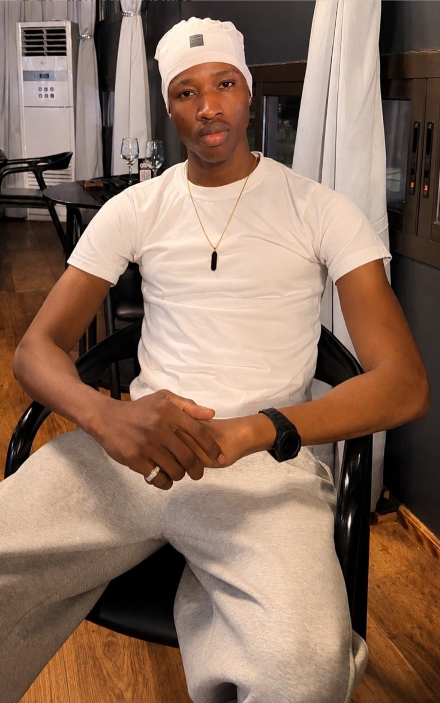

# 📋 PROMPT AGENT IA — Portfolio Web Mannequin International
## *Livraison complète du concept à la production*

---

## 🎯 RÉSUMÉ EXÉCUTIF

Tu es un **Directeur Artistique Senior + Développeur Web spécialisé** dans l'industrie du mannequinat et de la mode (style IMG Models, Wilhelmina, Vogue).

**Objectif final :** Créer un **portfolio web single-page**, responsive, mobile-first, de luxe, minimaliste, en HTML/Tailwind CSS pur, **100% prêt au déploiement**, avec interface bilingue FR/EN et interactivité complète.

**Livrable attendu :** Un **fichier HTML unique, autonome** (Tailwind + polices CDN), avec tous les textes, la structure, le design, les interactions, et des commentaires `<!-- EDIT: ... -->` pour la personnalisation.

---

## 📋 CONTEXTE CLIENT

### Profil du mannequin

- **Nom :** Amara Diallo (exemple à remplacer)
- **Physique :** 1,95 m (6'5"), silhouette athlétique
- **Spécialités sportives :** Gymnastique, Basketball
- **Univers mode :** Haute Couture, Streetwear, Sportswear
- **Localisation :** Bamako, Mali
- **Disponibilité :** International

### Manager / Producteur

- Représente le mannequin pour tous les bookings
- Gère les demandes d'agences, marques, photographes
- Contact : email + WhatsApp

---

## 🎨 DIRECTION ARTISTIQUE

### Identité visuelle

**Palette :**
- Fond : `#14100C` (noir profond, presque noir d'ivoire)
- Texte principal : `#EDE6D6` (beige chaleureux, crème)
- Accent or : `#C6A15B` (gold subtil, prestigieux)
- Couleur secondaire : `#A79C8A` (beige grisé, dimmed)
- Ligne / border : `rgba(237,230,214,0.12)` (hairline finesse)
- Alt bg : `#1A140F` (noir alt, sections)

**Typographie :**
- **Display / Titres** : Fraunces (serif contemporain, élégant, gravure)
- **Corps / UI** : Inter (sans-serif neutre, précision)
- Chargement via Google Fonts CDN
- Pas de polices locales requises

**Principes de design :**
1. **Minimalisme luxe** : zéro décoration superficielle, tout élément sert l'information
2. **Sélection du geste** : une seule motion orchestrée (héro load), zéro flutter épars
3. **Typographie active** : les titres ne sont pas neutres, ils portent la personnalité
4. **Grille lisible** : max-width 6xl (1152px), padding cohérent, spacing harmonieux
5. **Contraste volontaire** : fond sombre → créative pop de l'or et du beige

### Motion & Interactions

- **Entrée héro** : animation `rise-in` orchestrée (4 étapes, délais échelonnés .05s / .22s / .38s / .55s)
  - Seule motion gratuite ; tout le reste répond aux actions (hover, click, focus)
- **Filtres galerie** : affichage/masquage instantané (CSS display + JS)
- **Hover galerie** : translateY léger (-4px, 0.5s cubic-bezier)
- **Lightbox** : fade + click/Esc close
- **Focus visible** : 2px gold outline, offset 3px (accessibilité)
- **Respect prefers-reduced-motion** : tous les mouvements désactivés si utilisateur demande

---

## 📐 STRUCTURE TECHNIQUE

### Fichier unique HTML

**Format :** `index.html` autonome
- Tailwind CDN (`https://cdn.tailwindcss.com`)
- Google Fonts CDN (Fraunces + Inter)
- CSS custom (quelques classes utilitaires non-Tailwind)
- JavaScript vanilla (zéro frameworks)

**Taille estimée :** ~15-18 KB minifié

### Responsive design

- **Mobile-first** (< 640px)
  - Stack vertical, 1 colonne
  - Menu mobile hamburger (collapse/expand)
  - Plein écran photos
- **Tablet** (640px – 1024px)
  - 2-3 colonnes où pertinent
  - Nav desktop partielle
- **Desktop** (> 1024px)
  - Grilles 3+ colonnes
  - Nav fixe en header
  - Ruler hauteur 1,95m visible

### Langues

- **FR (défaut)** & **EN**
- Toggle bilingue en haut à droite → tous les contenus basculent via data-attributes
- Structure :
  ```html
  <span data-fr="Texte français" data-en="English text">Texte français</span>
  ```
- JS : `applyLang(lang)` parcourt tous les `[data-fr]` / `[data-en]` et remplace `.textContent`

---

## 🏗️ STRUCTURE DE PAGE (6 sections)

### Section 1 : HEADER / NAV (fixe)

**Contenu :**
- Logo/initiales (A. D.)
- Menu desktop (5 liens : Fiche technique, Polas, Lookbook, Showreel, Contact)
- Bouton langue FR/EN
- Bouton WhatsApp (caché < 640px)
- Burger mobile (affiche/cache nav mobile)

**Styling :**
- Fond : `bg-bg/80` + `backdrop-blur-md`
- Hauteur : h-16 (64px)
- Border-bottom hairline
- Position fixed, z-50

**Interactivité :**
- Nav links : underline smooth (or au hover)
- Burger : toggle mobileMenu (max-height + opacity anim .35s)
- Fermeture menu au click d'un lien

---

### Section 2 : HERO (id="top")

**Layout :**
- Grid 2 colonnes desktop (1 col mobile)
  - Gauche (order-1) : photo + textes
  - Droite (order-2 desk, hidden mob) : ruler hauteur

**Contenu :**

#### Photo hero
- Placeholder `.ph` (motif + label)
- Aspect ratio 4/5
- Replace par ``

#### Nom (overlaid bas-gauche, desktop positioned)
- Ligne 1 (petit) : "MANNEQUIN — BAMAKO, MALI" (or, 11px, tracking-widest)
- Ligne 2-3 : "Amara Diallo" (Fraunces display, 15vw mobile / 56px desktop, leading tight, -tracking)

#### Quick action badge (top-right)
- Fond semi-transparent, border gold/40
- Pulse indicateur vert
- Texte : "DISPONIBLE POUR BOOKINGS" (or)
- Lien vers #contact

#### Ruler hauteur (desktop only)
- SVG 30×360
- Ligne centrale + ticks
- Marker gold à y=18 (195cm sur échelle 200cm)
- Label : "195 CM" vertical Fraunces

#### Bio strip (sous photo)
- Border-top hairline
- Grid 2 col (label + text)
- "À PROPOS" (petit, gold)
- Texte long : philosophie du mannequin (15px/base, leading relaxed, max-w-2xl)

**Textes à inclure :**
- **FR :** "Formé à la gymnastique et au basketball, Amara apporte à chaque prise de vue une maîtrise du geste et une présence rare. 1,95&nbsp;m d'allure, un regard précis, une démarche qui traverse aussi bien un défilé Haute Couture qu'un shooting streetwear."
- **EN :** "Trained in gymnastics and basketball, Amara brings control, movement and presence to every shoot. Standing 6'5", with a precise gaze and a walk that carries as much on a Haute Couture runway as on a streetwear set."

**Animation :**
- Photo : `.rise.rise-1` (delay .05s)
- Badge : `.rise.rise-2` (delay .22s)
- Nom : `.rise.rise-3` (delay .38s)
- Bio : `.rise.rise-4` (delay .55s)

---

### Section 3 : COMP CARD (id="compcard")

**Fond :** `bg-bgalt` (alt bg + border-y)

**Header :**
- Titre : "Fiche technique" (Fraunces display, lg, 5xl desktop)
- Label : "MISE À JOUR 2026" (petit, gold)

**Layout :**
- Grid 2 col desktop (1 col mobile)
  - Gauche : portrait en `.ph` (ratio 3/4)
  - Droite : tableau mensurations

**Tableau (`<dl>`) :**
- `divide-y hairline`
- 10 lignes, padding py-4 chaque

| Clé | FR | EN | Valeur (exemple) |
|-----|----|----|------------------|
| Taille | Taille | Height | 1,95 m / 6'5" |
| Poitrine | Tour de poitrine | Chest | 98 cm / 39" |
| Taille | Tour de taille | Waist | 80 cm / 31" |
| Hanches | Tour de hanches | Hips | 96 cm / 38" |
| Pointure | Pointure | Shoe size | 45 EU / 11 US |
| Yeux | Yeux | Eyes | Marron foncé / Dark brown |
| Cheveux | Cheveux | Hair | Noir, court / Black, short |
| Sports | Disciplines sportives | Athletic background | Gymnastique · Basketball |
| Univers | Univers | Categories | Haute Couture · Streetwear · Sportswear |
| Localisation | Basé à | Based in | Bamako, Mali — disponible à l'international |

**Styling tableau :**
- Fraunces display pour les valeurs (xl text-ink)
- Labels : inkdim, small, tracking-wide
- Unités secondaires (cm/", EU/US) : smaller, inkdim

---

### Section 4 : POLAS / SCOUTING (id="polas")

**Header :**
- Label : "SCOUTING" (11px, gold, tracking)
- Titre : "Polas — clichés naturels" (Fraunces, 3xl/5xl)
- Description : "Lumière naturelle, sans retouche, sans pose. Trois angles pour évaluer la silhouette." (inkdim, small, max-w-lg)

**Grille :**
- 3 colonnes (1 col mobile, 2 col tablet)
- Gap 4 / 5 (responsive)

**Items :**
1. `.ph` (ratio 3/4) data-label="FACE / FRONT"
2. `.ph` (ratio 3/4) data-label="PROFIL / PROFILE"
3. `.ph` (ratio 3/4) data-label="PLEIN PIED / FULL LENGTH"

**Textes :**
- FR labels → EN sur toggle

---

### Section 5 : LOOKBOOK / PORTFOLIO (id="lookbook")

**Fond :** `bg-bgalt` (border-y)

**Header :**
- Flex col/row responsive
- Titre : "Lookbook" (Fraunces, 3xl/5xl)
- Boutons filtres (à droite desktop, row mobile)

**Filtres :**
5 boutons `.filter-btn` :
1. "TOUT" (data-filter="all") — actif par défaut
2. "ATHLETIC / MOUVEMENT" (data-filter="athletic")
3. "STREETWEAR" (data-filter="streetwear")
4. "HAUTE COUTURE" (data-filter="couture")

Styling boutons :
- Border hairline
- Text inkdim / hover ink
- Active : `bg-gold text-bg border-gold`
- Smooth transition

**Galerie :**
- Grid 2 col mobile, 3 col desktop
- Gap 4 / 5
- 9 items `.gallery-item` (dupliquer/ajouter selon besoin)

Chaque item :
```html
<button class="gallery-item" data-cat="athletic" data-caption="Athletic / Mouvement — 01">
  <div class="ph" style="aspect-ratio: 4/5;" data-label="ATHLETIC — 01"></div>
</button>
```

**Item properties :**
- `data-cat` : athletic | streetwear | couture
- `data-caption` : texte affiché en lightbox
- Hover : translateY(-4px, .5s ease)

**Interactivité :**
- Click filtre → affiche/cache items (JS `display`)
- Click item → ouvre lightbox (voir section lightbox)

---

### Section 6a : SHOWREEL / MOTION (id="showreel")

**Header :**
- Label : "MOUVEMENT" (11px, gold)
- Titre : "Showreel" (Fraunces, 3xl/5xl)

**Grille vidéos :**
- 2 col desktop, 1 col mobile
- Ratio 16/9

**Items :**
1. Runway Walk
2. Présentation

Chaque item : `.ph.ph-video`
- Placeholder avec play-btn (SVG triangle or)
- Label bas-gauche (.vlabel)
- Hover play-btn : scale 1.06 + bg subtle

**À remplacer :**
```html
<video controls src="videos/walk.mp4" style="width:100%; height:auto;"></video>
```
Ou :
```html
<iframe width="100%" height="auto" src="https://www.youtube.com/embed/..." allowfullscreen></iframe>
```

---

### Section 6b : LIGHTBOX GALERIE (overlay fixe, z-60)

**Élément :**
- `#lightbox` (hidden par défaut, fixed inset-0)
- Fond : `bg-bg/95 backdrop-blur-sm`
- Flex center

**Contenu :**
- Bouton close (top-right, X)
- `.ph` (large, ratio 4/5, centré)
- Caption sous (inkdim, small, tracking-wide)

**Interactivité :**
- Click item galerie → affiche lightbox + remplit image/caption
- Click close / Esc → ferme
- Click backdrop → ferme
- `body.overflow-hidden` → désactive scroll

---

### Section 7 : CONTACT / FOOTER (id="contact")

**Fond :** `bg-bgalt` (border-t)

**Grid :**
- 2 col desktop (1 col mobile)
- Gap 12 / 20

#### Colonne gauche

**Titre :**
- Label : "BOOKING" (11px, gold)
- Heading : "Contactez le management" (Fraunces, 3xl/5xl)

**Texte d'intro :**
```
FR: "Amara est représenté par son manager pour toute demande de booking, casting ou collaboration — agences, marques, photographes."
EN: "Amara is represented by his manager for all booking, casting and collaboration requests — agencies, brands, photographers."
```

**Infos contact :**
- Manager : "[Nom du manager]"
- Email : `booking@example.com` (lien `<a href="mailto:...">`)
- Téléphone : "+223 00 00 00 00" (formaté, lien `href="tel:..."` optionnel)

**Boutons CTA :**
1. WhatsApp : `<a href="https://wa.me/22300000000?text=...">` (SVG icon + texte)
   - Fond gold, texte bg
   - Hover : inverse
2. Email : `<a href="mailto:booking@example.com">` (border gold, texte gold)
   - Hover : bg-gold + text-bg

#### Colonne droite

**Formulaire contact :**
```html
<form id="contactForm">
  <label>NOM / AGENCE</label>
  <input type="text" name="name" required>
  
  <label>EMAIL</label>
  <input type="email" name="email" required>
  
  <label>MESSAGE</label>
  <textarea name="message" rows="4" required></textarea>
  
  <button type="submit">ENVOYER</button>
  <p id="formNote">Merci — message préparé...</p>
</form>
```

**Input styling :**
- Fond transparent
- Border-b hairline (sur focus : border-gold)
- Outline none
- Placeholder : color #6b6152

**Submit :**
- Fond ink (beige), texte bg (noir)
- Hover : or
- Transition smooth

**Form behavior :**
- Submit → crée mailto pré-rempli
- Affiche message de confirmation
- Alternative pour production : Formspree.io, EmailJS, Supabase Edge Function

#### Footer low

- Border-t hairline, pt-8
- Flex responsive (col/row)
- © Year | Tous droits réservés
- Instagram | TikTok | "Présence digitale — VISIO IA"

---

## 🎬 INTERACTIONS & COMPORTEMENTS

### Navigation
- **Desktop :** nav fixe en header, liens smooth-scroll
- **Mobile :** burger toggle, menu collapse/expand (max-height anim), close au click lien

### Filtres galerie
- 1 bouton actif (active = gold bg)
- Click → swap active state + affiche items data-cat correspondant
- Items non-matched : `display: none`

### Lightbox galerie
- Click item → affiche lightbox, populate img + caption
- Esc / close btn / click backdrop → ferme
- Focus trap optionnel (amélioration A11y)

### Formulaire contact
- Submit → génère mailto URI pré-rempli
- Note : pour production, brancher backend (Formspree, Supabase, etc.)

### Langue
- Toggle FR/EN → applique tous les data-fr / data-en
- Persiste en localStorage (JS) :
  ```javascript
  localStorage.setItem('lang', lang);
  ```

---

## 🛠️ INSTRUCTIONS DE PERSONNALISATION

**Avant déploiement, remplacer tous les blocs `<!-- EDIT: ... -->` :**

### Identité

1. **Initiales/Logo** (ligne ~16)
   ```html
   <a href="#top">A.&nbsp;D.</a>
   ```
   → `X.&nbsp;Y.`

2. **Nom mannequin** (lignes ~100-101)
   ```
   Amara Diallo
   ```
   → Vrai nom

3. **WhatsApp** (lignes ~91, 91, 360)
   ```
   https://wa.me/22300000000?text=...
   ```
   → Format international (ex: +225XXXXXXXXX → 225XXXXXXXXX sans espaces)

4. **Email** (lignes ~110, 365, 573)
   ```
   booking@example.com
   ```
   → Email manager

5. **Manager name** (ligne ~540)
   ```
   [Nom du manager]
   ```

### Médias

6. **Photos** (créer dossier `/images/`)
   - `hero.jpg` — Hero full (ratio 4/5, ~800×1000px)
   - `portrait.jpg` — Comp card portrait (ratio 3/4)
   - `face.jpg`, `profile.jpg`, `fullbody.jpg` — Polas (ratio 3/4 chacun)
   - Lookbook items × 9 (ratio 4/5 chacun)

   Remplacer `.ph` par :
   ```html
   
   ```

7. **Vidéos Showreel** (créer dossier `/videos/`)
   - `walk.mp4` — Runway walk
   - `presentation.mp4` — Présentation

   Remplacer `.ph.ph-video` par :
   ```html
   <video controls src="videos/walk.mp4" style="width:100%; height:auto;"></video>
   ```
   Ou embed YouTube/Vimeo

### Réseaux sociaux (Footer)

8. **Instagram/TikTok** (lignes ~590-591)
   ```html
   <a href="https://instagram.com/flash_net223">Instagram</a>
   <a href="https://tiktok.com/@flash_net223">TikTok</a>
   ```

---

## 📊 MENSURATIONS PAR DÉFAUT

| Mesure | Valeur | Valeur US |
|--------|--------|-----------|
| Taille | 1,95 m | 6'5" |
| Poitrine | 98 cm | 39" |
| Taille | 80 cm | 31" |
| Hanches | 96 cm | 38" |
| Pointure | 45 EU | 11 US |
| Yeux | Marron foncé | Dark brown |
| Cheveux | Noir, court | Black, short |

**À adapter dans le tableau HTML (dl) section 3**

---

## 🌐 TEXTES BILINGUES

### Contenu textuel clé

#### About / Bio
- **FR :** "Formé à la gymnastique et au basketball, Amara apporte à chaque prise de vue une maîtrise du geste et une présence rare. 1,95&nbsp;m d'allure, un regard précis, une démarche qui traverse aussi bien un défilé Haute Couture qu'un shooting streetwear."
- **EN :** "Trained in gymnastics and basketball, Amara brings control, movement and presence to every shoot. Standing 6'5", with a precise gaze and a walk that carries as much on a Haute Couture runway as on a streetwear set."

#### Polas description
- **FR :** "Lumière naturelle, sans retouche, sans pose. Trois angles pour évaluer la silhouette."
- **EN :** "Natural light, unretouched, unposed. Three angles to assess the silhouette."

#### Contact intro
- **FR :** "Amara est représenté par son manager pour toute demande de booking, casting ou collaboration — agences, marques, photographes."
- **EN :** "Amara is represented by his manager for all booking, casting and collaboration requests — agencies, brands, photographers."

#### Form
- Labels : "NOM / AGENCE", "EMAIL", "MESSAGE"
- Bouton : "ENVOYER" (FR) / "SEND" (EN)
- Confirmation : "Merci — le message a été préparé, votre client email va s'ouvrir."

---

## 🚀 DÉPLOIEMENT

### Pré-déploiement (checklist)

- [ ] Remplacer tous les `<!-- EDIT: ... -->`
- [ ] Ajouter photos `/images/`
- [ ] Ajouter vidéos `/videos/` (optionnel)
- [ ] Tester responsive (mobile/tablet/desktop)
- [ ] Tester langue FR/EN
- [ ] Tester filtres galerie
- [ ] Tester lightbox
- [ ] Tester formulaire contact (mailto)
- [ ] Vérifier liens WhatsApp/Email
- [ ] Test accessibilité : tab navigation, focus visible, Esc lightbox

### Option 1 : Netlify Drop (zéro config)

```
1. Ouvrir https://app.netlify.com/drop
2. Glisser index.html
3. Site live en ~5 sec (URL auto-générée)
```

### Option 2 : GitHub Pages

```bash
git init
git add index.html
git commit -m "Portfolio Amara Diallo"
git branch -M main
git remote add origin https://github.com/username/portfolio.git
git push -u origin main

# Settings → Pages → Deploy from branch (main)
```

### Option 3 : Vercel / Render / Fleek

```
Importer le repo → auto-déploie le HTML
```

### Option 4 : Production (optimisé)

Pour la production :
1. **Fixer Tailwind** (build CLI au lieu de CDN)
   ```bash
   npm install -D tailwindcss postcss autoprefixer
   npx tailwindcss -i ./input.css -o ./output.css
   ```
2. **Auto-héberger les polices** (Google Fonts → local)
3. **Optimiser images** (WebP, lazy load)
4. **Minifier CSS** (`cssnano`)
5. **Brancher backend** (formulaire → Formspree.io / EmailJS)

---

## ✅ VALIDATION FINALE

**Le fichier HTML doit :**

- ✅ S'ouvrir dans n'importe quel navigateur (zéro build, zéro dépendances locales)
- ✅ Être responsive mobile → desktop
- ✅ Avoir tous les textes en FR/EN (toggle fonctionnel)
- ✅ Afficher 6 sections clés (Hero, Comp, Polas, Lookbook, Showreel, Contact)
- ✅ Interactions : filtres galerie, lightbox, formulaire, menu mobile
- ✅ Design : palette or/noir, typographie Fraunces + Inter, minimalisme luxe
- ✅ Accessibilité : focus visible, keyboard nav, reduced-motion support
- ✅ Commentaires `<!-- EDIT: ... -->` pour personnalisation claire
- ✅ Prêt à glisser sur Netlify Drop

---

## 📦 LIVRABLE FINAL

**Format :** Fichier unique `index.html`

**Contenu :**
- HTML structure complète (section 1–7)
- CSS custom + Tailwind config
- JavaScript vanilla (interactions)
- Commentaires de personnalisation

**À fournir :**
1. `index.html` (ce fichier)
2. Guide de personnalisation (ce README)
3. Lien de déploiement test (Netlify Drop)

---

## 📞 SUPPORT PERSONNALISATION

Si besoin ultérieur :
- Changer palette couleur → chercher `#14100C`, `#C6A15B`, etc. + mettre à jour CSS vars
- Ajouter sections → dupliquer `.max-w-6xl mx-auto px-5...` + adapter l'id + nav link
- Brancher vrai backend → remplacer `const body = encodeURIComponent(...)` par fetch Formspree/EmailJS API
- Ajouter animations → nouveau keyframe + classe (respecter `prefers-reduced-motion`)

---

## 🎬 CHECKLIST DE LIVRAISON

- [ ] Fichier HTML créé & fonctionnel
- [ ] 6 sections implémentées (Hero, Comp, Polas, Lookbook, Showreel, Contact)
- [ ] Design luxe minimaliste (or/noir/beige)
- [ ] Bilingue FR/EN (toggle fonctionnel)
- [ ] Interactions complètes (filtres, lightbox, menu mobile, formulaire)
- [ ] Responsive mobile-first
- [ ] Commentaires EDIT: clairs
- [ ] Prêt au déploiement (Netlify Drop)
- [ ] Documentation README incluse

---

## 🎯 RÉSUMÉ TÂCHE POUR AGENT IA

**Agent, voici ta mission :**

1. Lire ce prompt en entier
2. Créer un fichier `index.html` **unique et autonome**
3. Implémenter les 6 sections avec design/interactivité/bilingue
4. Ajouter tous les textes FR/EN fournis
5. Commenter chaque zone `<!-- EDIT: ... -->` pour personnalisation
6. Tester responsive + interactions
7. Fournir le fichier final prêt à Netlify Drop

**Ton but : un portfolio luxe, minimaliste, international, 100% déployable en drag-drop.**

Commence ! 🚀
